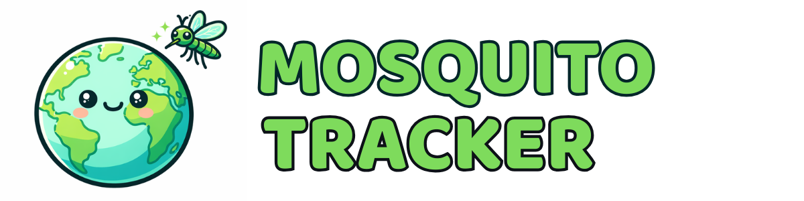

<div align="center">


*Global mosquito surveillance platform combining NASA satellite data with GLOBE Observer citizen science observations.*

*Optimized for low-bandwidth connections in developing countries.*

[](https://astro.build)
[](https://svelte.dev)
[](https://capacitorjs.com)
[](https://observer.globe.gov/)
<a href="https://geoemerge.devpost.com/">
  
</a>
</div>

## Overview

GLOBE Observer Lite is a lightweight reimagining of the NASA GLOBE Observer app, built to work in areas with limited or intermittent connectivity. The app enables citizen scientists worldwide to contribute environmental observations even on 2G networks.

### Key Features

- **Ultra-lightweight**: < 200KB initial load (vs 2-5MB for standard apps)
- **Offline-first**: Queue observations and sync when online
- **Smart compression**: Client-side WebP conversion (70-90% size reduction)
- **Mobile-ready**: Native iOS/Android apps via Capacitor
- **Background sync**: Service Worker handles uploads automatically

## Live Demo

```bash
git clone https://github.com/matheusmaldaner/MosquitoTracker
cd globe-lite
npm install
npm run dev
```

Then visit `http://localhost:4321`

## Performance Comparison

| Metric | Standard App | Our App | Improvement |
|--------|--------------|------------|-------------|
| Initial Load | 2-5 MB | < 200 KB | **10-25x** |
| Time on 3G | 5-8 sec | < 2 sec | **4x faster** |
| Offline Support | No | Yes | **Full** |
| Image Upload | 2-5 MB | < 500 KB | **5-10x** |

## Features

### Interactive Global Map
- Real-time mosquito habitat observations from the **GLOBE Observer API**
- Disease risk zones based on NASA satellite monitoring methodology
- Toggle layers: GLOBE observations, disease risk zones, density heatmap
- Species-coded markers (Aedes, Anopheles, Culex)
- Marker clustering for performance with thousands of observations
- Embeddable via iframe for external sites

**View the map:** Visit `/map` or embed `/map-embed.html`

### NASA Data Integration
- **MODIS** - Vegetation indices (NDVI) and land surface temperature (250m-1km resolution, daily)
- **GPM IMERG** - Global precipitation data (~10km resolution, 30-min updates)
- **Landsat 8/9** - Water body detection for breeding sites (30m resolution)

### Mosquito Species Tracking
| Species | Diseases | Active Time | Breeding Sites |
|---------|----------|-------------|----------------|
| **Anopheles** | Malaria | Dusk to dawn | Clean, sunlit water pools |
| **Aedes aegypti** | Dengue, Zika, Chikungunya | Daytime | Containers, tires, urban areas |
| **Culex** | West Nile, Rift Valley Fever | Nighttime | Polluted water, flooded areas |

## Project Structure

```
NasaHackathon/
├── README.md
├── mosquitotracker.webp
└── globe-lite/               # Main application
    ├── public/
    │   ├── sw.js             # Service Worker (offline caching)
    │   ├── offline.html      # Offline fallback page
    │   └── manifest.json     # PWA manifest
    ├── src/
    │   ├── components/       # Svelte components
    │   ├── lib/
    │   │   ├── offline-storage.ts   # IndexedDB wrapper
    │   │   ├── sync-worker.ts       # Upload sync logic
    │   │   └── globe-api.ts         # GLOBE API client
    │   ├── layouts/
    │   └── pages/
    ├── android/              # Android native project
    ├── ios/                  # iOS native project
    └── capacitor.config.ts   # Capacitor configuration
```

## Commands

All commands run from the `globe-lite/` directory:

| Command | Description |
|---------|-------------|
| `npm run dev` | Start dev server at `localhost:4321` |
| `npm run build` | Build production site to `./dist/` |
| `npm run preview` | Preview production build locally |
| `npm run cap:sync` | Build and sync to native platforms |
| `npm run cap:android` | Build, sync, and open Android Studio |
| `npm run cap:ios` | Build, sync, and open Xcode |

## How It Works

### Offline Storage Flow

1. **Capture**: User captures photo + metadata
2. **Compress**: Image compressed to WebP (< 500KB)
3. **Queue**: Observation saved to IndexedDB
4. **Sync**: Service Worker uploads when online
5. **Confirm**: User notified of sync status

### Service Worker Strategy

- **GET requests**: Cache-first for assets, network-first for API
- **POST requests**: Passed through (not intercepted)
- **Offline**: Returns cached content or offline.html fallback
- **Background Sync**: Automatically retries failed uploads

## Recommended Infrastructure

For NASA/GLOBE to implement at scale:

| Layer | Technology | Why |
|-------|------------|-----|
| **Framework** | Astro | Zero JS by default, fastest load times |
| **Components** | Svelte | 50% smaller than React |
| **Database** | Turso (Edge SQLite) | Global low latency, serverless |
| **Cache** | Upstash Redis | 8+ regions, <50ms reads globally |
| **Images** | Cloudflare R2 | Auto WebP/AVIF conversion |
| **Hosting** | Vercel/Cloudflare | Edge deployment, global CDN |

### Why Edge Database?

- **Turso**: SQLite at the edge with global read replicas - no round-trip to US servers
- **Upstash Redis**: Optimized for READ-heavy workloads (viewing observations is far more common than submitting)
- **Global coverage**: Nodes in Johannesburg, Lagos, Nairobi (Africa), Singapore, Mumbai (Asia), São Paulo (South America)

## Tech Stack

- **[Astro](https://astro.build)**: Zero-JS-by-default framework
- **[Svelte 5](https://svelte.dev)**: Lightweight reactive components
- **[Tailwind CSS](https://tailwindcss.com)**: Utility-first styling
- **[Capacitor](https://capacitorjs.com)**: Native mobile wrapper
- **[browser-image-compression](https://github.com/nicolo-ribaudo/browser-image-compression)**: Client-side WebP compression

## Embedding the Map

Embed the interactive map in any website:

```html
<iframe
  src="https://your-domain.vercel.app/map-embed.html"
  width="100%"
  height="500"
  frameborder="0"
  title="GLOBE Mosquito Habitat Map">
</iframe>
```

## GLOBE API Integration

The app integrates with the [GLOBE API](https://api.globe.gov/search/swagger-ui.html) for:

- Fetching existing observations (GeoJSON format)
- Submitting new observations (requires API key + approved app)
- Protocol support: Clouds, Mosquito Habitat, Land Cover, Tree Heights, Sky Conditions

Important notes:
- The Search API in the Swagger UI is read-only (GET queries). You do not create those endpoints.
- Uploads are a separate submission API that requires approval and developer credentials.
- This app uses **server-side proxy endpoints** (`/api/globe/*` and `/api/globe-upload`) to avoid CORS and keep keys server-side. This requires a dynamic deployment (Astro `output: 'server'` / Vercel adapter).

### API Endpoint
```
https://api.globe.gov/search/v1/measurement/?protocols=mosquito_habitat_mapper
```

### Quick Tutorial

Read-only (no auth):
1. `cd globe-lite && npm install && npm run dev`
2. Use pages like `/observer` and `/test-api` to fetch live data.
3. No env vars required if you only read data, but you must run in dev or deploy dynamically so the `/api/globe/*` proxy exists.

Enable uploads (requires credentials):
1. Obtain a GLOBE developer key/access per the submission API.
2. Set env vars (example):
   ```bash
   GLOBE_API_KEY=your_key
   GLOBE_API_KEY_HEADER=x-api-key
   GLOBE_UPLOAD_URL=your_upload_endpoint
   ```
3. The app will submit through `/api/globe-upload` (server-side proxy).

## Scientific Basis

Based on NASA Earth Observatory research: [Tracking Disease by Satellite](https://science.nasa.gov/earth/earth-observatory/tracking-disease-by-satellite/)

Key methodology:
1. MODIS NDVI anomalies indicate wetter conditions = better mosquito habitat
2. GPM precipitation tracks rainfall creating breeding sites
3. Land surface temperature identifies optimal breeding ranges (15-40°C)
4. Combined analysis predicts outbreak risk 7-14 days ahead

## Mobile Development

### Android

```bash
cd globe-lite
npm run cap:android
# In Android Studio: Run > Run 'app'
```

### iOS (macOS only)

```bash
cd globe-lite
npm run cap:ios
# In Xcode: Product > Run
```

## Team

GeoEMERGE Hackathon 2026

## License

MIT License - Open source for global health impact

## Acknowledgments

- NASA Earth Science Data Systems
- GLOBE Observer Program
- MODIS Science Team
- GPM Mission
- WHO (disease burden statistics)

## Resources

- [GLOBE Program](https://www.globe.gov)
- [GLOBE API Documentation](https://api.globe.gov/search/swagger-ui.html)
- [Astro Documentation](https://docs.astro.build)
- [Capacitor Documentation](https://capacitorjs.com/docs)
